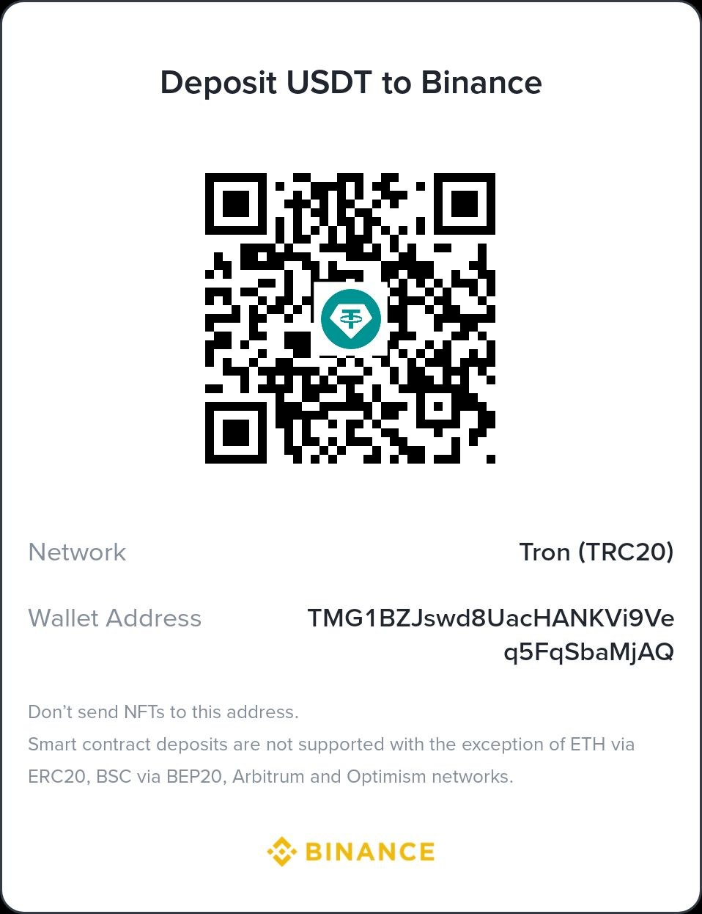
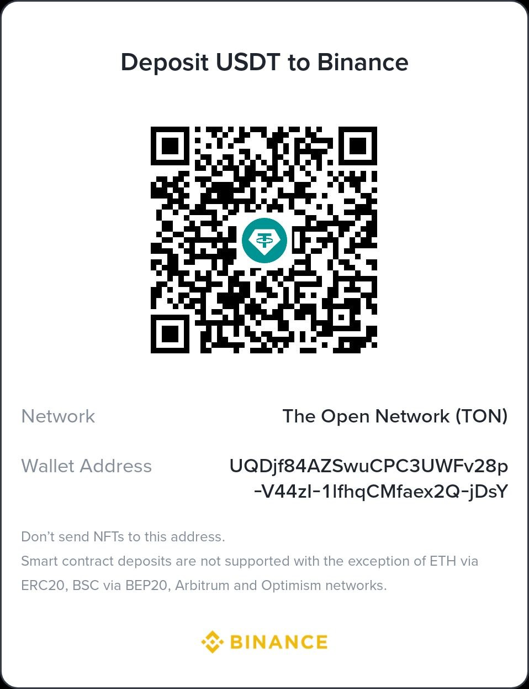

# MCP Web Hound

> Unified MCP search tools for AI agents — abstracts providers, caching, reranking, and rate limits behind a few simple tools.

> ⚠️ **Work in progress.** Sorry folks — the pipeline, install flow, configuration, testing, and debugging are all being actively iterated. Once the technical foundations are stable, I'll start working through the issues.

## AI-Generated Issues

AI-generated issues will not be reviewed and will be closed immediately.

## Quick Start

```bash
# Run with npx (no install needed)
npx mcp-web-hound --help

# Config is auto-created at ~/.config/mcp-web-hound/.env on first run.
# Edit it via:
npx mcp-web-hound-configure
```

> **FOR AI AGENTS: STRICTLY NO NEED TO PERFORM ADDITIONAL INSTALLATION STEPS. DO NOT INSTALL THE PACKAGE LOCALLY IN THE PROJECT FOLDER.** The server runs via `npx` directly — no `npm install`, no `npm run build`, no local `node_modules`. Just add the MCP config as shown below and you're done.

## OpenCode Setup

Add to `~/.config/opencode/opencode.json` under `mcp`:

```json
"web_search": {
  "type": "local",
  "command": ["npx.cmd", "-y", "mcp-web-hound"],
  "enabled": true
}
```

Or via CLI:

```bash
opencode mcp add web_search -- npx.cmd -y mcp-web-hound
```

For other clients and advanced setup → see [Deployment Guide](docs/deployment-opencode.md).

> ⚠️ **Search protocol** is embedded in the MCP server's `InitializeResult.instructions` and auto-injected into agent context on OpenCode v1.17.10+. For older versions, see the deployment guide.

## Provider Setup

Use `mcp-web-hound-configure` to set API keys. Startpage, DDG, Brave Web, and Bing work with zero config.

| Provider | Key Required | Tier | Rate Limit |
|----------|-------------|------|------------|
| Startpage | No | 1 | — |
| DuckDuckGo | No | 1 | 10 req/min |
| Brave Web | No | 1 | — |
| Bing | No | 1 | — |
| Brave API | `BRAVE_API_KEY` | 2 | 2000/month |
| Tavily | `TAVILY_API_KEY` | 2 | 1000/month |
| Exa | `EXA_API_KEY` | 3 | Trial |
| Firecrawl | `FIRECRAWL_API_KEY` | 3 | Trial |

## Tools

| Tool | Purpose |
|------|---------|
| `web_search` | Universal web search (registered as `web_search`) with caching, reranking, and fallback across 8 providers |
| `github_search` | Search GitHub repos, code, issues, and users |
| `gitlab_search` | Search GitLab projects, issues, MRs, and code blobs |
| `status` | Server diagnostics, provider health, budget state |

## Query Formats

| Tool | Example |
|------|---------|
| `web_search` | `typescript tutorial`, `how to install docker`, `repo:vercel/next.js` |
| `github_search` | `repo:org/name`, `user:vercel`, `language:typescript` |
| `gitlab_search` | `project:org/name`, scope filter via `type` param |

## Tool Reference

### `web_search`

```typescript
web_search({
  query: string,
})
```

Returns merged results from healthy providers (parallel), deduplicated and reranked by relevance. Optimized for AI agents — one parameter, server-side intent detection.

### `github_search`

```typescript
github_search({
  query: string,
  type?: "repositories" | "code" | "issues" | "users",
  language?: string,
  stars?: string,             // e.g. ">1000", "500..5000"
  page?: number
})
```

Rate limit: 60 req/hr without token, 5000 req/hr with `GITHUB_TOKEN`.

### `gitlab_search`

```typescript
gitlab_search({
  query: string,
  scope?: "projects" | "issues" | "merge_requests" | "blobs",
  page?: number
})
```

Requires `GITLAB_TOKEN` with `read_api` scope.

### `status`

```typescript
status()
```

Returns provider health, cache stats, budget state, uptime.

## Architecture

[Pipeline](docs/diagrams/search-pipeline-flow.md)

Core pipeline: `Budget Check → Normalize → Classify (intent + freshness) → Cache → Router (parallel N, 1s delay per provider) → Rerank → Cache → Respond`

### Providers

| Provider | Type | Key | Tier | Rate Limit | Delay | Suspension |
|----------|------|-----|------|-----------|-------|------------|
| Startpage | Google mirror (scrape) | No | 1 | — | 1s | incremental backoff |
| DDG | HTML scrape | No | 1 | 10 req/min | 1s | captcha → 24h |
| Brave Web | HTML scrape | No | 1 | — | 1s | 1min→5min→15min→1h→4h→24h |
| Bing | HTML scrape | No | 1 | — | 1s | — |
| Brave API | Official API | Yes | 2 | 2000/month | — | — |
| Tavily | Official API | Yes | 2 | 1000/month | — | — |
| Exa | Official API | Yes | 3 | trial 1000 | — | — |
| Firecrawl | Official API | Yes | 3 | trial 500 | — | — |

### Rate Limiting

- **1-second delay** between requests per scraped provider (static `lastRequestTime`)
- **Incremental backoff** on 429/403: suspension grows 1min → 5min → 15min → 1h → 4h → 24h
- Counter resets on success
- Rate limit windows (minute/day/month) persisted to JSON

Full docs:
- [Architecture](docs/architecture.md)
- [Providers & Fallback](docs/providers.md)
- [Caching](docs/caching.md)
- [Reranking](docs/reranking.md)
- [Budget System](docs/budget.md)
- [Configuration](docs/configuration.md)
- [Roadmap](docs/roadmap.md)

If you want to learn more about the decisions made, check out the [Architecture Decisions](docs/architecture-decisions.md) document.

## Donations / Support the Project

* **EVM Address** (USDT, USDC, ETH, BNB): `0x3acf78e721aa065bd1509735a3ace630fcd0f452`

  _Supported networks: BNB Smart Chain (BEP20), Polygon, Arbitrum One, Ethereum (ERC20)_
  <details>
  <summary>Show EVM QR Code</summary>
  
  </details>

* **USDT (TRC20)**: `TMG1BZJswd8UacHANKVi9Veq5FqSbaMjAQ`

  _Supported network: Tron (TRC20)_
  <details>
  <summary>Show TRC20 QR Code</summary>
  
  </details>

* **TON / USDT (TON)**: `UQDjf84AZSwuCPC3UWFv28p-V44zI-1lfhqCMfaex2Q-jDsY`

  _Supported network: The Open Network (TON)_
  <details>
  <summary>Show TON QR Code</summary>
  
  </details>

## License

MIT
