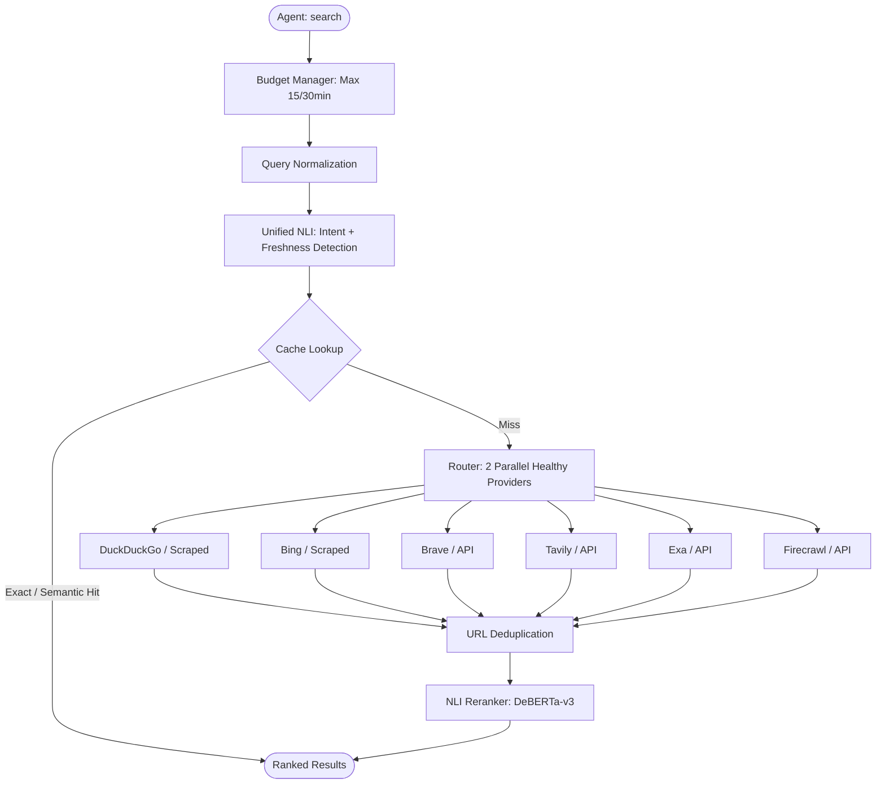

# Architecture Decisions

**Current Project Status:** The target architecture **Stage 3 (V3)** is implemented. This document traces the evolution of our architectural decisions from the initial MVP to the current "invisible" integration, providing essential context for the codebase.

## Goal

### The problem

Every existing MCP search plugin had something wrong with it.

The paid ones were expensive — you pay per request, and any optimization like caching happens on their side to save *their* money, not yours. You still get charged the same whether it's a cache hit or a fresh query.

The free ones were too simple. A plugin that only talks to DuckDuckGo works until DDG blocks you. One that only talks to Bing works until Microsoft blocks you. No fallback. No caching. No result processing. And let's be honest — DDG and Bing rank worse than Google. The agent gets mediocre results and has no idea it's missing better ones.

SearXNG looked promising at first. But it's a full search server built for a completely different job — self-hosted meta-search for humans. You need Docker or a Python environment, and on Windows it just doesn't work without Docker (I tried). It's the wrong tool for an MCP plugin — but I plan to keep evolving this plugin toward SearXNG-level capability, purpose-built for MCP.

What about telling the agent to search via Playwright or fetch? Sure, you *can* prompt it to open a browser. But the model won't do it on its own — you'd need a massive system prompt instructing it step by step. I tried that. It ate a quarter of my system prompt, made the agent worse at following other instructions, diluted the context, and still didn't work reliably. Bad idea all around.

### The approach

Build an MCP search server from scratch that does one thing well: accept a query, return ranked results, and stay out of the agent's way.

- **Query in, results out** — the tool takes `query` and optionally `include_content`. Nothing else. Everything else is handled server-side.
- **Fail-safe by default** — six providers in a priority chain. If DDG rate-limits you, Bing takes over. If Bing changes its HTML, Brave handles it.
- **Two layers of caching** — exact match (SQLite) and semantic (vector similarity). Similar queries don't burn budget.
- **NLI reranking** — same DeBERTa model that classifies the query also scores every result. The agent gets what's actually relevant, not just what a search engine decided was #1.
- **Free to run** — two scraped providers (DDG, Bing) work with zero cost. The API providers (Brave, Tavily, Exa, Firecrawl) all have generous free tiers.

The whole thing is a single Node.js process — one `npx build`, one `node dist/index.js`, and it talks stdio JSON-RPC. No Docker. No database server. No dependencies outside npm.

---

## Stage 1 — MVP (V1)

### Goal
A working MCP search tool — agent calls `search()`, gets results back. One provider, basic cache, no frills.

### Architecture

```text
Agent → MCP Transport → Budget Check → Normalize → Cache → DDG → Return
```

### Why

- **MCP over stdio** — the simplest transport for AI agents. No HTTP server, no ports, no auth. The agent spawns the process and talks JSON-RPC over stdin/stdout.
- **DDG HTML scraping** — free, no key, works immediately. Crawl before you walk.
- **SQLite** — zero-config, single-file, embedded. No Postgres to install. `better-sqlite3` is synchronous and fast.
- **Budget first** — agents can loop. If you don't gate searches upfront, a runaway agent burns your API budget in one session.
- **Sequential fallback** — DDG → Bing. Simple. If DDG fails, try the next.

### Trade-offs

| Choice | Cost |
|--------|------|
| HTML scraping | Fragile — DDG changes markup and parsing breaks |
| Sequential providers | Slow — one provider at a time, no parallelism |
| Exact cache only | Same wording needed for cache hit — "react hooks" ≠ "react hooks tutorial" |

---

## Stage 2 — Semantic Layer + Tier 2 Providers (V2)

### Goal
Smarter caching, more providers, ranked results.

### Architecture

```text
Agent → Budget → Normalize → Classify → Semantic Cache → Exact Cache → Router → DDG + Bing + Brave + Tavily → Reranker → Return
```

### What changed

| Change | Why |
|--------|-----|
| **Semantic cache** | "react hooks" and "react hooks tutorial" should hit the same cache. Embedding similarity (threshold 0.92) catches paraphrases. |
| **Reranker** | Providers return raw results. Reranker scores them by: NLI relevance + domain authority + freshness + position. Agent gets quality over quantity. |
| **Parallel providers** | Call 2 providers at once instead of one at a time. Faster, more coverage. |
| **Brave + Tavily APIs** | Official APIs are more stable than scraping. Brave (2000 free req/mo) and Tavily (1000 free req/mo) fill gaps when DDG/Bing fail. |
| **Health tracking** | If Brave errors 3x in a row, mark unhealthy and skip it. Try again after 5 minutes. Without this, a dead provider blocks the pipeline. |
| **Intent classification** | "github:react" should route differently from "react tutorial". NLI zero-shot detects intent (github/docs/news/web) without training data. |

### Why NLI for reranking

Keyword matching ranks by word overlap — "react hooks lifecycle" matches "react lifecycle hooks" but misses "componentDidMount in functional components". NLI (Natural Language Inference) reads the *meaning*: given snippet X, does it *entail* (support) the query? It's slower (~10ms per result) but far more accurate for fuzzy information needs.

### Trade-offs

| Choice | Cost |
|--------|------|
| NLI model (177M params) | ~120MB download, ~10-15ms per inference on CPU |
| Semantic embedding | ~118MB model, first-load latency |
| Parallel providers | Harder to debug, need rate-limit coordination |

---

## Stage 3 — Implicit Freshness + NLI Reranking (V3) — *Target Architecture*

### Goal
Remove all agent-facing configuration. The server figures out everything — intent, freshness, relevance — without the agent telling it what to do.

### Core Pipeline



### The key insight

In V2, the agent passed `freshness: "day" | "week" | "month" | "any"`. This was bad because:
1. **Agents shouldn't have to think about it** — an agent doesn't naturally reason about what freshness a query needs, and in most cases it just ignores the field anyway. But it *does* burn tokens parsing the schema and deciding what to send. Making it work properly would mean giving the agent a separate task just to compose MCP queries, or writing an entire search skill — that's insane. So I moved all of that to a small model on the server. It just runs. No prompts needed.
2. **Hard to tune** — if you ask "latest GPT-5 news" and set `freshness: "any"`, you get stale results
3. **Bloated schema** — every extra param is surface area for bugs

### What changed

| Change | Why |
|--------|-----|
| **Implicit freshness detection** | NLI zero-shot on the query itself: "does this query *imply* a need for recent information?" Score > 0.45 → `requiresFreshness = true`. No agent input needed. |
| **Unified NLI model** | One model (DeBERTa-v3-xsmall) does everything: intent classification, freshness detection, and result reranking. Lazy-loaded on first request. |
| **Freshness scoring** | `requiresFreshness=false` → 3-year plateau at 1.0, then gradual decay. Protects fundamental knowledge (algorithms, API refs). `requiresFreshness=true` → 1-month plateau, then steep decay. Suits news/releases. |
| **Missing date → 1.0** | No `published_date`? Score 1.0. Never penalise a result for lacking metadata. |
| **Fixed formula** | `0.9*NLI + 0.04*domain + 0.03*freshness + 0.03*position`. Same weights for all intents. Intent-specific weights were over-engineering for zero measurable gain. |
| **No intent/freshness in tool schema** | Agent calls `search({ query })`. That's it. Everything else is server-side. |

### Freshness curve

```text
requiresFreshness=false (muted):
  ≤3yr → 1.0   ≤5yr → 0.6   >5yr → 0.1

requiresFreshness=true (news):
  ≤1mo → 1.0   ≤1yr → 0.4   >1yr → 0.0
```

The muted mode is the more important design decision. It means a query like "JavaScript Array.map" returns the MDN article from 2023 with the same freshness score as one from 2026. Without this, stable documentation would be unfairly penalised just because it hasn't changed.

### Date parsing per provider

| Provider | Date source | Coverage |
|----------|-------------|----------|
| DuckDuckGo | `<span> YYYY-MM-DDTHH:MM:SS</span>` in `result__extras` | ~90% |
| Bing | `<span>Month Day, Year</span>` in `b_caption` | ~40% |
| Brave | `age` field — absolute ("March 27, 2026") or relative ("2 weeks ago") | ~70% |
| Tavily | No date field | ~0% |
| Exa | `publishedDate` (camelCase) | ~80% |
| Firecrawl | No date field | ~0% |

Six providers, three tiers. The router picks the first 2 healthy ones in parallel. Results are deduplicated by normalized URL, scored, and the top 10 are returned.

### Why six providers?

- **DDG + Bing** — free, no keys, different indexes. Together they cover most queries.
- **Brave** — stable API, reliable dates, good for news.
- **Tavily** — AI-oriented, returns extracted content out of the box.
- **Exa + Firecrawl** — semantic search and scraping. Lower priority, useful for edge cases.

No single provider is reliable enough on its own. DDG changes markup. Bing rate-limits. Brave has a 2000/mo cap. With 6 providers in a priority chain, the server degrades gracefully instead of failing.

Honestly though — these are just all the free ones I could find :D

### What was removed

- `freshness` param from agent schema
- `intent` as an intermediate classification layer — replaced by direct NLI query-to-snippet comparison, which improved ranking accuracy from 84% to 88%
- `RERANK_WEIGHT_*` config — weights are hardcoded
- `INTENT_CLASSIFICATION_ENABLED` — classifier always runs
- Freshness column from cache schema
- Freshness multiplier from TTL calculation

### Resource Footprint & Performance

| Component | Resource Requirement | Overhead / Behavior |
|-----------|----------------------|---------------------|
| **Disk Space** | ~240 MB | Local ONNX cache for embedding & NLI models. |
| **Memory (RAM)** | ~250-300 MB | Node.js process baseline + lazy-loaded models in V8 heap. |
| **Inference Time** | 10–15ms / request | Executed entirely on CPU. Highly optimized for local execution. |

### Robustness

- **DDG/Bing parseResults()** detect captcha/blocking responses and throw descriptive errors with remediation hints instead of silently returning empty results
- **Integration tests** always run (no vitest exclude) to catch HTML structure changes immediately
- **Budget manager** limits 15 searches and 30 fetches per 30-minute window

---

## Summary

```text
V1: Make it work         — DDG + Bing, SQLite cache, budget
V2: Make it smart        — Semantic cache, 4 providers, NLI reranking
V3: Make it invisible    — Implicit freshness, unified NLI, no agent-facing params
```

Each stage removed complexity from the agent's side and moved it to the server. The end state: the agent types a query and gets ranked, fresh, deduplicated results. No config, no params, no surprises.

### Future Roadmap & Known Limitations

- **Scraping Fragility:** DDG/Bing HTML parsing remains a vector for silent degradation. Strict monitoring via CI/CD integration tests is required.
- **Distributed Caching:** Future iterations may include optional cache synchronization between local instances (without adding heavy DB servers or complicating the infrastructure).