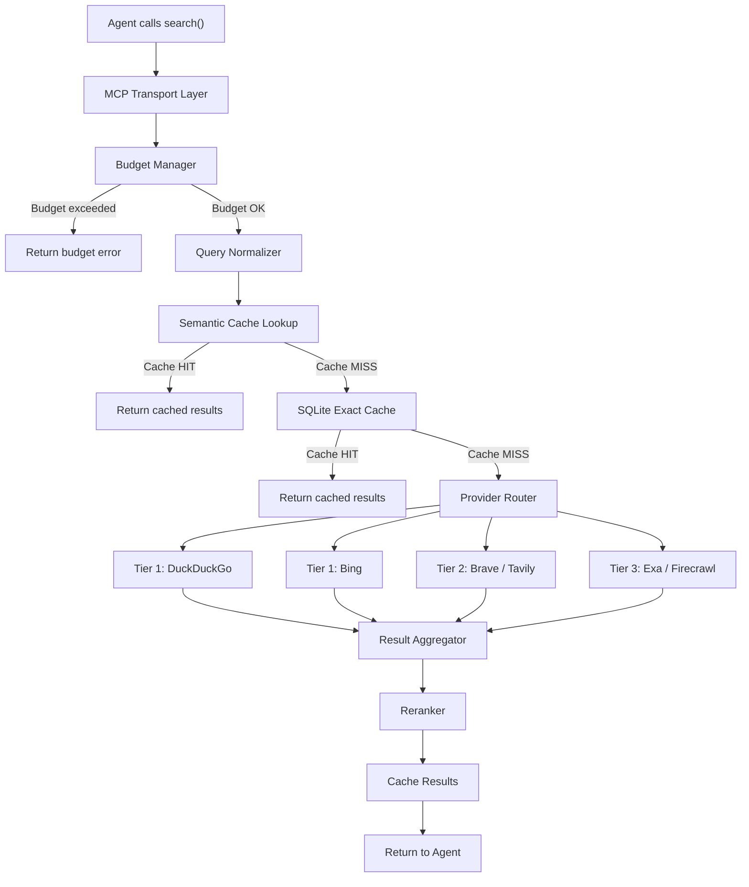
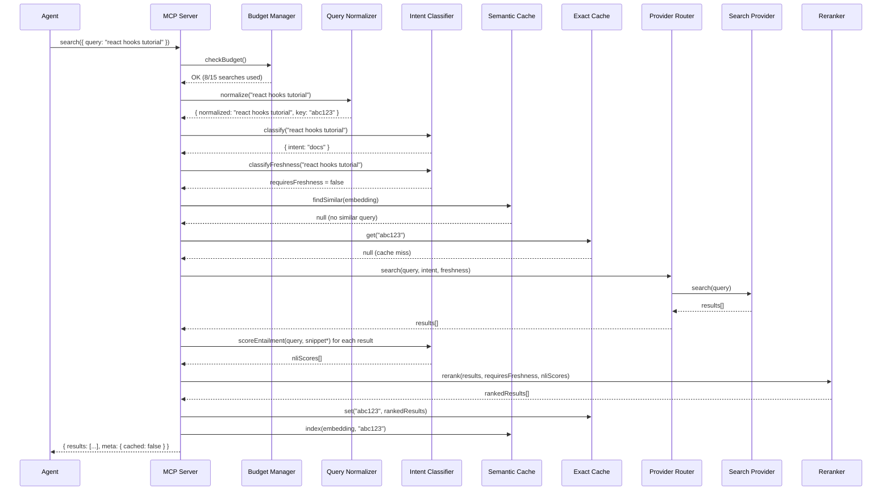
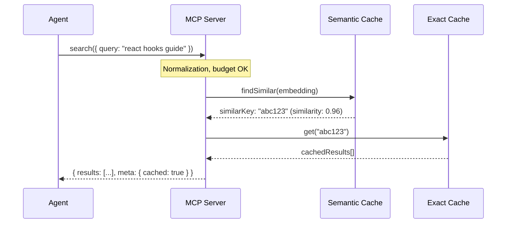

# Search MCP Server Architecture

## Pipeline Overview

Each `search()` call goes through a linear pipeline:



## System Layers

### 1. MCP Transport Layer (`src/index.ts`)

Entry point. Registers 4 tools via `@modelcontextprotocol/sdk`: `search`, `github_search`, `gitlab_search`, `status`. Handles JSON-RPC over stdio.

**Responsibilities:**
- Tool registration
- Input validation (zod)
- Response serialization
- Top-level error handling

### 2. Budget Manager (`src/limits/budget-manager.ts`)

First gate. If the task budget is exceeded — immediate rejection without calling providers.

**Responsibilities:**
- Search count in current window
- Page fetch count in current window
- Semantic deduplication of similar queries
- Budget rejection with clear message

### 3. Query Normalizer (`src/search/query-normalizer.ts`)

Normalizes agent queries for better cache hits and more consistent results.

**Responsibilities:**
- Lowercase conversion
- Whitespace and special character cleanup
- Abbreviation expansion (optional)
- Stable cache key generation

### 4. Semantic Cache (`src/cache/semantic-cache.ts`)

Looks for semantically similar queries with cached results.

**Responsibilities:**
- Query embedding computation
- Nearest neighbor search in sqlite-vec
- Configurable similarity threshold (default 0.92)
- Return cached results for similar query

### 5. SQLite Exact Cache (`src/cache/sqlite.ts`)

Exact-match cache using normalized cache keys.

**Responsibilities:**
- Store queries, results, pages
- TTL-based eviction
- Stats for status() tool

### 6. Provider Router (`src/search/provider-router.ts`)

Selects providers and manages fallback logic.

**Responsibilities:**
- Health-based provider selection
- Parallel request to 2 healthy providers
- Provider health tracking
- Rate limit enforcement

### 7. Search Providers (`src/search/providers/`)

Adapters for specific search engines. All implement the `SearchProvider` interface.

### 8. Intent Classifier (`src/search/intent-classifier.ts`)

Auto-detects query intent (github / docs / news / web) via NLI zero-shot
(`Xenova/nli-deberta-v3-xsmall`). Also exposes `scoreEntailment()` for reranking.

**Responsibilities:**
- Query intent classification (4 labels, softmax, threshold 0.45)
- Language extraction for github intent
- NLI entailment scoring for reranking

### 9. Reranker (`src/search/reranker.ts`)

Final ranking of aggregated results using NLI entailment scores and implicit freshness detection.

**Responsibilities:**
- NLI entailment scoring (via shared classifier)
- Domain quality scoring
- Implicit freshness scoring (NLI-based query analysis + published_date)
- Position blending

### 10. Content Fetcher (`src/fetch/`)

Optional layer for downloading and cleaning web pages.

**Responsibilities:**
- HTTP GET with retry and timeout
- HTML → Markdown (readability + turndown)
- Content truncation by max length
- SQLite page caching

## Data Flow

### Normal Search (cache miss)



### Semantic Cache Hit



### 11. Data Model

### Core Types

```typescript
interface SearchRequest {
  query: string;
  intent: "web" | "docs" | "github" | "news";
}

interface SearchResult {
  title: string;
  url: string;
  snippet: string;
  source: string;
  published_date?: string;
  relevance_score: number;
}

interface SearchResponse {
  results: SearchResult[];
  meta: SearchMeta;
}

interface SearchMeta {
  total_results: number;
  cached: boolean;
  query_normalized: string;
  search_time_ms: number;
}
```

### Provider Interface

```typescript
interface SearchProvider {
  name: string;
  tier: 1 | 2 | 3;

  search(query: string, options: ProviderOptions): Promise<ProviderResult[]>;
  healthCheck(): Promise<boolean>;

  getStats(): ProviderStats;
}

interface ProviderOptions {
  intent: string;
  freshness: string;
  max_results: number;  // internal, set by orchestrator
}

interface ProviderResult {
  title: string;
  url: string;
  snippet: string;
  published_date?: string;
  raw_position: number;
  provider: string;
}

interface ProviderStats {
  requests_today: number;
  limit_today: number | null;
  avg_latency_ms: number;
  last_error?: string;
  healthy: boolean;
}
```

## Principles

1. **Agent Ignorance** — agent does not see provider internals
2. **Graceful Degradation** — if Tier 1 fails, fallback to Tier 2/3
3. **Cache First** — semantic → exact → provider
4. **Budget Safety** — hard limits on searches and fetches
5. **Single NLI Model** — intent classification, freshness detection, and reranking share one DeBERTa-v3-xsmall instance
