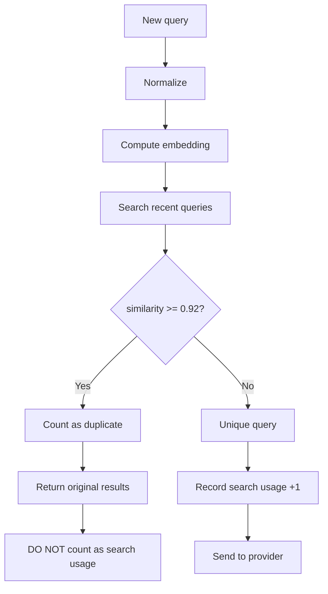
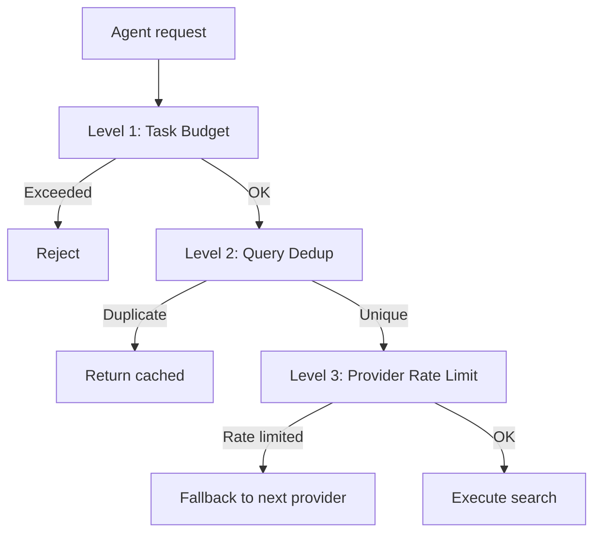

# Budget System — Protecting Against Runaway Agents

## Problem

An AI agent can enter a search loop:
- Query the same topic with different wording
- Fetch dozens of pages without using results
- Exhaust provider API limits in a single task
- Slow down work with infinite fetch requests

## Budget Manager (`src/limits/budget-manager.ts`)

### Per-Task Limits

| Resource | Limit | Description |
|----------|-------|-------------|
| Search queries | 10–15 | Unique search queries to providers |
| Page fetches | 20–30 | Page content downloads |
| Budget window | 30 minutes | Sliding time window |

**Configuration:**
```env
BUDGET_MAX_SEARCHES=15
BUDGET_MAX_FETCHES=30
BUDGET_WINDOW_MINUTES=30
```

### Mechanics

```typescript
interface TaskBudget {
  window_start: number;      // Window start (Unix timestamp)
  window_minutes: number;    // Window size in minutes
  max_searches: number;      // Search query limit
  max_fetches: number;       // Page fetch limit
  searches_used: number;     // Searches consumed
  fetches_used: number;      // Fetches consumed
}

class BudgetManager {
  checkBudget(type: "search" | "fetch"): BudgetCheckResult;
  recordUsage(type: "search" | "fetch"): void;
  getRemaining(): { searches: number; fetches: number };
  reset(): void;
}

interface BudgetCheckResult {
  allowed: boolean;
  remaining: number;
  message?: string;
}
```

### Budget Exceeded Response

```json
{
  "error": "BUDGET_EXCEEDED",
  "message": "Search budget exhausted: 15/15 searches used in current 30-minute window. Budget resets at 14:35 UTC. Try rephrasing your approach or waiting.",
  "budget": {
    "searches_used": 15,
    "searches_max": 15,
    "fetches_used": 22,
    "fetches_max": 30,
    "resets_at": "2024-01-15T14:35:00Z"
  }
}
```

---

## Query Deduplication

### Problem

Agents often search for the same thing with different wording:

```
"opencode plugins"
"opencode plugin docs"
"opencode plugin documentation"
"how to create opencode plugin"
```

Without deduplication — 4 provider calls. With deduplication — 1.

### Algorithm



### Recent Query Buffer

```typescript
interface RecentQuery {
  query: string;
  embedding: number[];
  timestamp: number;
  cache_key: string;
}

class DeduplicationBuffer {
  private buffer: RecentQuery[] = [];
  private maxSize = 50;            // Last 50 queries
  private ttl = 30 * 60 * 1000;   // 30 minutes

  isDuplicate(embedding: number[]): RecentQuery | null {
    this.evictExpired();

    for (const recent of this.buffer) {
      if (cosineSimilarity(embedding, recent.embedding) >= 0.92) {
        return recent;
      }
    }
    return null;
  }

  add(query: RecentQuery): void {
    this.buffer.push(query);
    if (this.buffer.length > this.maxSize) {
      this.buffer.shift();
    }
  }
}
```

### Example

```
[14:00:01] search("opencode plugins")
  → Budget: 1/15 searches
  → Providers: DDG → 10 results
  → Cached under key "abc123"

[14:00:15] search("opencode plugin docs")
  → Embedding similarity with "opencode plugins": 0.94
  → DEDUPLICATED → return cached results for "abc123"
  → Budget: still 1/15 (not counted)

[14:00:30] search("opencode plugin documentation")
  → Embedding similarity with "opencode plugins": 0.93
  → DEDUPLICATED → return cached results for "abc123"
  → Budget: still 1/15 (not counted)

[14:01:00] search("vscode extensions api")
  → Embedding similarity with all recent: max 0.45
  → UNIQUE → send to providers
  → Budget: 2/15 searches
```

---

## Provider Rate Limiting

In addition to task budget, each provider has its own rate limits:

```typescript
interface ProviderRateLimit {
  requests_per_minute: number;
  requests_per_day: number;
  requests_per_month: number;
  current_minute: number;
  current_day: number;
  current_month: number;
}

// Defaults
const RATE_LIMITS = {
  duckduckgo:  { rpm: 10, rpd: 200, rpm_month: Infinity },
  brave:       { rpm: 15, rpd: 60, rpm_month: 2000 },
  tavily:      { rpm: 10, rpd: 30, rpm_month: 1000 },
  exa:         { rpm: 10, rpd: 30, rpm_month: 1000 },
  firecrawl:   { rpm: 5,  rpd: 15, rpm_month: 500 },
};
```

## Summary: Three Protection Layers


