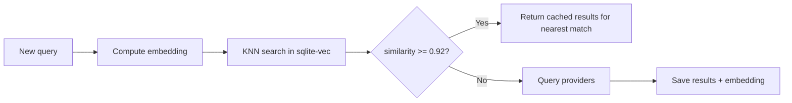

# Caching

## Overview

Two-level caching system: semantic layer on top of SQLite.

```
Agent query
    ↓
[Semantic Cache] ← embedding similarity
    ↓ (miss)
[SQLite Exact Cache]  ← normalized query key
    ↓ (miss)
Providers
    ↓
Results → save to both caches
```

## SQLite Exact Cache

### Database Schema

```sql
-- Cached queries
CREATE TABLE queries (
    id            INTEGER PRIMARY KEY AUTOINCREMENT,
    cache_key     TEXT NOT NULL UNIQUE,
    query_raw     TEXT NOT NULL,
    query_norm    TEXT NOT NULL,
    intent        TEXT NOT NULL DEFAULT 'web',
    created_at    INTEGER NOT NULL,
    expires_at    INTEGER NOT NULL,
    hit_count     INTEGER NOT NULL DEFAULT 0,
    last_hit_at   INTEGER
);

CREATE INDEX idx_queries_cache_key ON queries(cache_key);
CREATE INDEX idx_queries_expires ON queries(expires_at);

-- Cached search results
CREATE TABLE results (
    id            INTEGER PRIMARY KEY AUTOINCREMENT,
    query_id      INTEGER NOT NULL REFERENCES queries(id) ON DELETE CASCADE,
    title         TEXT NOT NULL,
    url           TEXT NOT NULL,
    snippet       TEXT NOT NULL,
    source_domain TEXT NOT NULL,
    published_date TEXT,
    relevance_score REAL NOT NULL DEFAULT 0.0,
    position      INTEGER NOT NULL,
    provider      TEXT NOT NULL,
    created_at    INTEGER NOT NULL
);

CREATE INDEX idx_results_query_id ON results(query_id);
CREATE INDEX idx_results_url ON results(url);

-- Cached pages (fetch layer)
CREATE TABLE pages (
    id            INTEGER PRIMARY KEY AUTOINCREMENT,
    url           TEXT NOT NULL UNIQUE,
    url_hash      TEXT NOT NULL,
    title         TEXT,
    content_md    TEXT NOT NULL,
    content_length INTEGER NOT NULL,
    fetched_at    INTEGER NOT NULL,
    expires_at    INTEGER NOT NULL,
    fetch_time_ms INTEGER NOT NULL,
    status_code   INTEGER NOT NULL
);

CREATE INDEX idx_pages_url_hash ON pages(url_hash);
CREATE INDEX idx_pages_expires ON pages(expires_at);

-- Provider statistics
CREATE TABLE provider_stats (
    id            INTEGER PRIMARY KEY AUTOINCREMENT,
    provider      TEXT NOT NULL,
    date          TEXT NOT NULL,
    requests      INTEGER NOT NULL DEFAULT 0,
    errors        INTEGER NOT NULL DEFAULT 0,
    avg_latency_ms REAL NOT NULL DEFAULT 0,
    UNIQUE(provider, date)
);
```

### TTL Strategy

| Data Type | TTL | Logic |
|-----------|-----|-------|
| Web search | 6 hours | General search |
| Docs search | 3 hours | Documentation |
| News search | 30 minutes | Fast-changing news |
| GitHub search | 4 hours | Issues/PRs update often |
| Fetched pages | 1–7 days | Page content is stable |

**TTL Formula:**
```typescript
function calculateTTL(intent: string): number {
  const baseTTL: Record<string, number> = {
    web:    6 * 3600,
    docs:   3 * 3600,
    news:   30 * 60,
    github: 4 * 3600,
  };
  return baseTTL[intent] ?? baseTTL.web;
}
```

### Eviction

- **Periodic:** Every 30 minutes, expired records are removed
- **Size-based:** If DB > 500MB, oldest records with lowest hit_count are removed
- **Manual:** `PRAGMA wal_checkpoint(TRUNCATE)` after eviction

---

## Semantic Cache

### Purpose

**Not a RAG system.** The semantic layer solves a narrow set of problems:

1. **Similar query matching** — "react hooks tutorial" ≈ "react hooks guide"
2. **Deduplication** — avoid repeated provider calls
3. **Reuse** — return results from similar queries
4. **Reranking** — NLI-based query-to-snippet entailment scoring (see [reranking.md](reranking.md))

### Embedding Models

| Model | Dimensions | Size | Multilingual | Speed |
|-------|-----------|------|-------------|-------|
| `multilingual-e5-small` | 384 | ~118MB | Yes | Fast |
| `bge-m3` | 1024 | ~570MB | Yes | Medium |

**Recommendation:** `multilingual-e5-small` for MVP (smaller, faster, sufficient accuracy).

### Embedding Storage

```sql
-- sqlite-vec extension
-- Virtual table for vector search
CREATE VIRTUAL TABLE query_embeddings USING vec0(
    query_id INTEGER PRIMARY KEY,
    embedding FLOAT[384]
);
```

**Operations:**
```sql
-- Insert embedding
INSERT INTO query_embeddings (query_id, embedding) VALUES (?, ?);

-- Nearest neighbor search
SELECT
    query_id,
    distance
FROM query_embeddings
WHERE embedding MATCH ?
ORDER BY distance
LIMIT 5;
```

### Similarity Threshold

```typescript
const SEMANTIC_CACHE_THRESHOLD = 0.92;  // cosine similarity

// If similarity >= 0.92, treat as cache hit
// and return results from the matching query
```

**Why 0.92:**
- 0.95+ is too strict — only near-identical queries match
- 0.85 is too loose — different topics get merged
- 0.92 is a good balance: catches paraphrases without mixing topics

### Example

```
Query 1: "opencode plugins"          → embedding A → provider → results R
Query 2: "opencode plugin docs"      → embedding B → similarity(A, B) = 0.94 → cache HIT → R
Query 3: "opencode plugin documentation" → embedding C → similarity(A, C) = 0.93 → cache HIT → R
Query 4: "vscode extensions"         → embedding D → similarity(A, D) = 0.61 → cache MISS → provider
```

### Lifecycle


