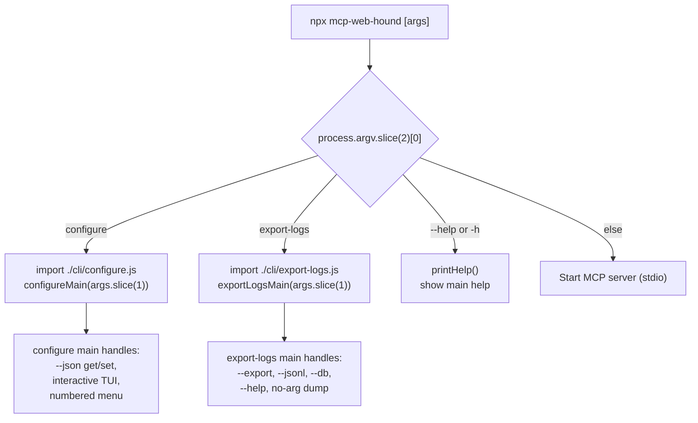
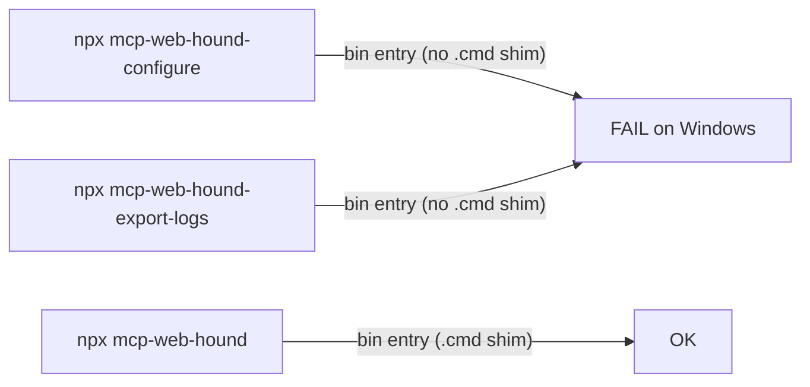
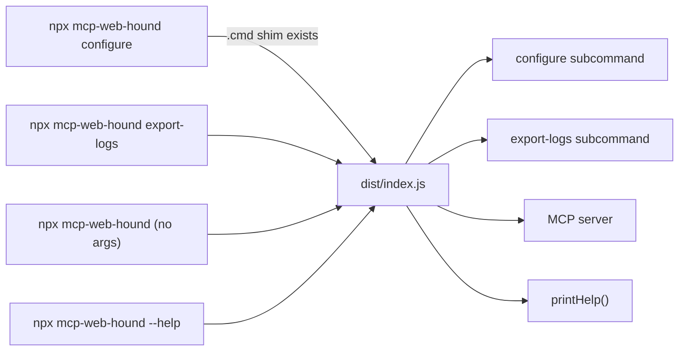

# CLI Entry Point Flow

## Command dispatch

## Before (old)

Each tool was a separate npm bin entry that npx could not resolve as sub-binaries on Windows:

## After (new)

All commands route through the main bin entry, which dispatches to subcommand handlers:

