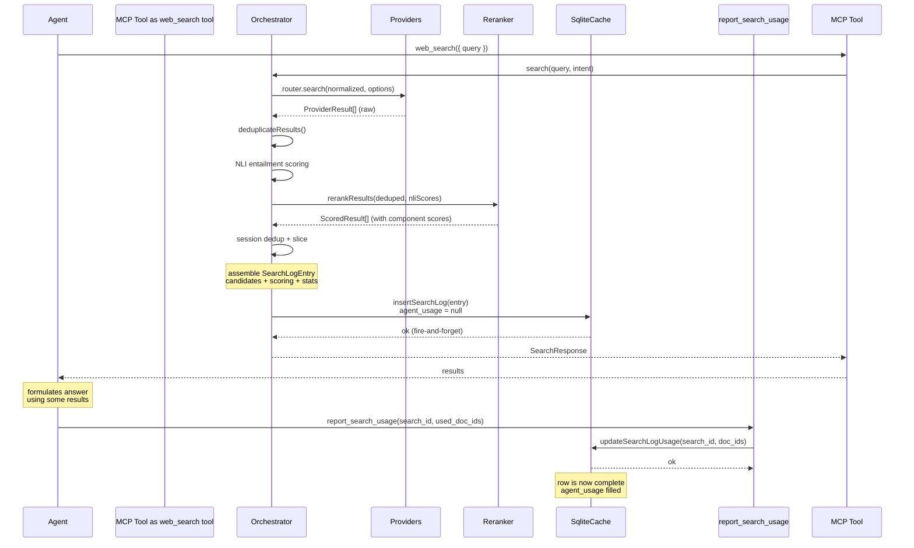

# Search Logging Flow

## Pipeline Overview



## Data Flow

```mermaid
flowchart TD
    Providers["search providers<br/>DuckDuckGo, Bing, Startpage..."] -->|ProviderResult[]| Dedup

    Dedup["cross-provider dedup<br/>normalizeUrl + Map"] -->|unique ProviderResult[]| NLI

    NLI["NLI entailment<br/>IntentClassifier.scoreEntailment()"] -->|nliScores[]| Rerank

    Rerank["rule-based reranker<br/>0.9*NLI + 0.04*domain + 0.03*freshness + 0.03*position"] -->|ScoredResult[]| SessionDedup

    SessionDedup["session dedup<br/>remove already-seen URLs"] -->|SearchResult[]| Return

    Return["return to agent"] -->|search_id in response| Agent

    Rerank -->|all ScoredResult[]| LogAssembly

    subgraph LogAssembly["logSearch() - fire-and-forget"]
        A["build providerRankingsByUrl"] --> B["generate doc_id = sha256(url)[:12]"]
        B --> C["assemble candidates[] + scoring{}"]
        C --> D["build SearchLogEntry"]
        D --> E["cache.insertSearchLog(entry)<br/>SQLite INSERT agent_usage=NULL"]
    end

    Agent -->|report_search_usage| UsageUpdate

    UsageUpdate["updateSearchLogUsage()<br/>SQLite UPDATE agent_usage = [...used]"] --> CompleteEntry

    CompleteEntry["complete training sample<br/>query + candidates + scoring + usage"]

    style LogAssembly fill:#e8f5e9
    style UsageUpdate fill:#e3f2fd
    style CompleteEntry fill:#fff3e0
```

## SQLite Schema

```sql
CREATE TABLE search_logs (
  search_id     TEXT PRIMARY KEY,
  data_json     TEXT NOT NULL,    -- full SearchLogEntry JSON
  agent_usage   TEXT,             -- JSON array of used doc_ids, or null
  created_at    TEXT NOT NULL,
  updated_at    TEXT NOT NULL
);
```

## Log Entry Shape

```json
{
  "type": "search",
  "data_role": "production_log",
  "search_id": "uuid",
  "query": "...",
  "normalized_query": "...",
  "intent": "web",
  "providers_used": ["startpage", "bing"],
  "candidates": [
    {
      "doc_id": "sha256(url)[:12]",
      "title": "...",
      "snippet": "...",
      "url": "...",
      "provider_rankings": [
        { "source": "startpage", "engine_rank": 1 }
      ]
    }
  ],
  "scoring": {
    "doc_id": {
      "baseline_score": 0.897,
      "signals": {
        "nli": 0.91,
        "domain": 0.85,
        "freshness": 1.0,
        "position_bias": 0.82
      }
    }
  },
  "stats": {
    "total_from_providers": 40,
    "unique_after_dedup": 24,
    "returned_to_agent": 10
  },
  "final_order": ["doc_id_1", "doc_id_2"],
  "agent_usage": ["doc_id_1"],
  "system_version": {
    "mcp": "1.4.2",
    "ranker": "v1",
    "signals": "v1",
    "nli_model": "Xenova/nli-deberta-v3-xsmall"
  },
  "meta": {
    "timestamp": "2026-06-30T10:30:00Z",
    "latency_ms": 3420,
    "cache_hit": false
  }
}
```

## Dataset Export

```sql
SELECT data_json
FROM search_logs
WHERE agent_usage IS NOT NULL
ORDER BY created_at;
```

Each row is a self-contained, atomic training sample — no joins, no orphaned data.

## CLI Export Tool

The package ships with `mcp-web-hound export-logs` for command-line export:

```bash
# All entries (JSON)
npx mcp-web-hound export-logs

# Only training-ready entries (with agent_usage)
npx mcp-web-hound export-logs --export

# Training dataset in JSONL format (one JSON object per line)
npx mcp-web-hound export-logs --export --jsonl > training-data.jsonl

# Custom database path
npx mcp-web-hound export-logs --db ./data/search.db --export

# Help
npx mcp-web-hound export-logs --help
```

The tool searches for the database in order:
1. `./data/search.db` (project-local)
2. `~/.mcp-web-hound/data/search.db` (npx runtime)
3. `~/.config/mcp-web-hound/data/search.db` (config dir)

Use `--db <path>` to override.
