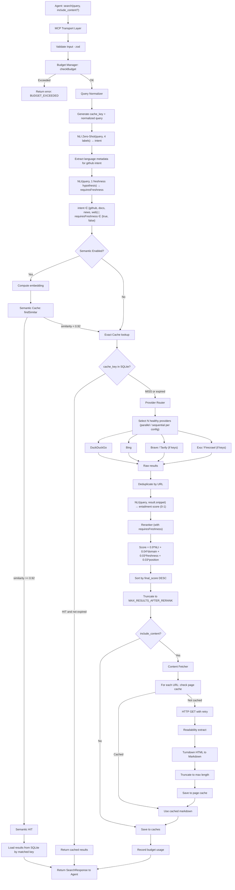
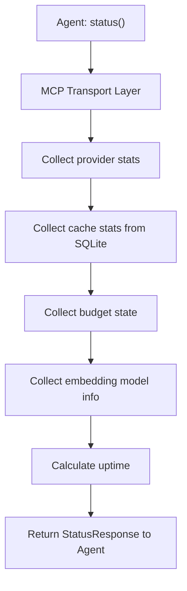
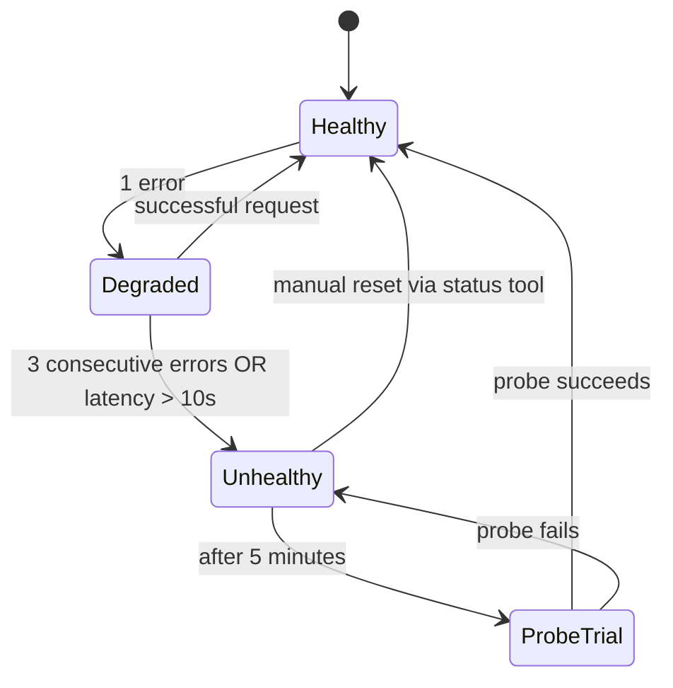

# Search Pipeline Flow

## Main Search Flow

```mermaid
flowchart TD
    A["Agent: search(query, include_content?)"] --> B[MCP Transport Layer]
    B --> C[Validate Input - zod]
    C --> D[Budget Manager: checkBudget]
    D -->|Exceeded| D_ERR["Return error: BUDGET_EXCEEDED"]
    D -->|OK| E[Query Normalizer]
    E --> F["Generate cache_key + normalized query"]

    F --> FC["NLI Zero-Shot(query, 4 labels) → intent"]
    FC --> INTENT_META["Extract language metadata for github intent"]
    INTENT_META --> FR["NLI(query, 1 freshness hypothesis) → requiresFreshness"]
    FR --> FF["intent ∈ {github, docs, news, web} | requiresFreshness ∈ {true, false}"]

    FF --> G{Semantic Enabled?}
    G -->|Yes| H[Compute embedding]
    H --> I[Semantic Cache: findSimilar]
    I -->|"similarity >= 0.92"| J[Semantic HIT]
    J --> K[Load results from SQLite by matched key]
    I -->|"similarity < 0.92"| L[Exact Cache lookup]
    G -->|No| L

    L --> M{cache_key in SQLite?}
    M -->|HIT and not expired| N[Return cached results]
    M -->|MISS or expired| O[Provider Router]

    O --> P["Select N healthy providers (parallel / sequential per config)"]
    P --> Q1["DuckDuckGo"]
    P --> Q2["Bing"]
    P --> Q3["Brave / Tavily (if keys)"]
    P --> Q4["Exa / Firecrawl (if keys)"]

    Q1 & Q2 & Q3 & Q4 --> R[Raw results]

    R --> S[Deduplicate by URL]
    S --> S2["NLI(query, result.snippet) → entailment score (0-1)"]
    S2 --> T["Reranker (with requiresFreshness)"]
    T --> U["Score = 0.9*NLI + 0.04*domain + 0.03*freshness + 0.03*position"]
    U --> V[Sort by final_score DESC]
    V --> W[Truncate to MAX_RESULTS_AFTER_RERANK]

    W --> X{include_content?}
    X -->|No| Y[Save to caches]
    X -->|Yes| Z[Content Fetcher]
    Z --> Z1[For each URL: check page cache]
    Z1 -->|Cached| Z2[Use cached markdown]
    Z1 -->|Not cached| Z3[HTTP GET with retry]
    Z3 --> Z4[Readability extract]
    Z4 --> Z5[Turndown HTML to Markdown]
    Z5 --> Z6[Truncate to max length]
    Z6 --> Z7[Save to page cache]
    Z7 --> Z2
    Z2 --> Y

    Y --> AA[Record budget usage]
    AA --> AB["Return SearchResponse to Agent"]

    K --> AB
    N --> AB
```

## Status Flow

```mermaid
flowchart TD
    A["Agent: status()"] --> B[MCP Transport Layer]
    B --> C[Collect provider stats]
    C --> D[Collect cache stats from SQLite]
    D --> E[Collect budget state]
    E --> F[Collect embedding model info]
    F --> G[Calculate uptime]
    G --> H["Return StatusResponse to Agent"]
```

## Provider Health Recovery

```mermaid
stateDiagram-v2
    [*] --> Healthy
    Healthy --> Degraded: 1 error
    Degraded --> Healthy: successful request
    Degraded --> Unhealthy: 3 consecutive errors OR latency > 10s
    Unhealthy --> ProbeTrial: after 5 minutes
    ProbeTrial --> Healthy: probe succeeds
    ProbeTrial --> Unhealthy: probe fails
    Unhealthy --> Healthy: manual reset via status tool
```
