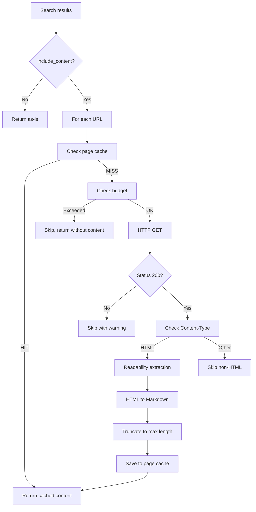

# Fetch Layer

## Overview

The Fetch Layer handles downloading, cleaning, and converting web pages to Markdown. Activates when `include_content: true` is set in the search request.



## Fetcher (`src/fetch/fetcher.ts`)

### Responsibilities

- HTTP GET requests with configurable timeout
- Retry with exponential backoff
- Respectful crawling (User-Agent, domain delay)
- Content-Type validation
- Response size limit

### Configuration

```typescript
interface FetcherConfig {
  timeout_ms: number;        // Default: 10000 (10 sec)
  max_retries: number;       // Default: 2
  retry_delay_ms: number;    // Default: 1000
  max_body_size: number;     // Default: 5MB
  user_agent: string;        // Default: Mozilla/5.0 (Windows NT 10.0; Win64; x64) AppleWebKit/537.36
  concurrent_limit: number;  // Default: 3 parallel fetches
  delay_between_ms: number;  // Default: 500 per domain
}
```

### Request Headers

```typescript
const DEFAULT_HEADERS = {
  "User-Agent": "Mozilla/5.0 (Windows NT 10.0; Win64; x64) AppleWebKit/537.36 (KHTML, like Gecko) Chrome/131.0.0.0 Safari/537.36",
  "Accept": "text/html,application/xhtml+xml",
  "Accept-Language": "en-US,en;q=0.9",
  "Accept-Encoding": "gzip, deflate",
};
```

### Retry Strategy

```typescript
// Exponential backoff
const delays = [1000, 2000, 4000]; // ms

// Retry only on:
const RETRYABLE_STATUS = [429, 500, 502, 503, 504];
const RETRYABLE_ERRORS = ["ECONNRESET", "ETIMEDOUT", "ENOTFOUND"];

// Do NOT retry on:
// 400, 401, 403, 404 — client errors, retry is useless
```

---

## Readability (`src/fetch/readability.ts`)

### Cleaning Pipeline

```
Raw HTML
  ↓
[mozilla/readability] — extract main content
  ↓
Cleaned HTML (no nav, sidebar, ads, footer)
  ↓
[turndown] — HTML → Markdown
  ↓
Post-processing
  ↓
Clean Markdown
```

### Dependencies

| Package | Purpose |
|---------|---------|
| `@mozilla/readability` | Extract main content from HTML |
| `linkedom` | DOM parsing for readability |
| `turndown` | HTML → Markdown conversion |
| `turndown-plugin-gfm` | GFM tables, strikethrough support |

### Post-processing

After Markdown conversion:

```typescript
function postProcess(markdown: string): string {
  return markdown
    // Remove multiple empty lines
    .replace(/\n{3,}/g, "\n\n")
    // Remove empty headings
    .replace(/^#{1,6}\s*$/gm, "")
    // Remove inline styles
    .replace(/\{[^}]*style[^}]*\}/g, "")
    // Normalize spaces
    .replace(/[ \t]+$/gm, "")
    // Trim
    .trim();
}
```

### Content Truncation

```typescript
const MAX_CONTENT_LENGTH = 8000;  // characters

function truncateContent(content: string, maxLength: number): string {
  if (content.length <= maxLength) return content;

  // Truncate at last complete paragraph
  const truncated = content.substring(0, maxLength);
  const lastParagraph = truncated.lastIndexOf("\n\n");

  if (lastParagraph > maxLength * 0.5) {
    return truncated.substring(0, lastParagraph) + "\n\n[... truncated]";
  }

  return truncated + "\n\n[... truncated]";
}
```

---

## Page Caching

Fetched pages are cached in the `pages` table (see [caching.md](caching.md)).

**Page TTL:** 1–7 days (depends on domain).

```typescript
const PAGE_TTL: Record<string, number> = {
  // Documentation — long TTL (rarely changes)
  "docs":        7 * 24 * 3600,    // 7 days
  "readthedocs": 7 * 24 * 3600,
  "developer":   5 * 24 * 3600,    // 5 days

  // GitHub — medium TTL
  "github.com":  2 * 24 * 3600,    // 2 days

  // Q&A — medium TTL
  "stackoverflow": 3 * 24 * 3600,  // 3 days

  // News, blogs — short TTL
  "medium.com":  1 * 24 * 3600,    // 1 day
  "dev.to":      1 * 24 * 3600,

  // Default
  "default":     2 * 24 * 3600,    // 2 days
};
```

## Limitations

- No PDF, image, or video downloads
- No JavaScript execution (SPAs not supported)
- Max 3 concurrent fetches
- Respectful delay between requests to the same domain
- No `robots.txt` checking — not needed: not a crawler, budget limits already protect sites
