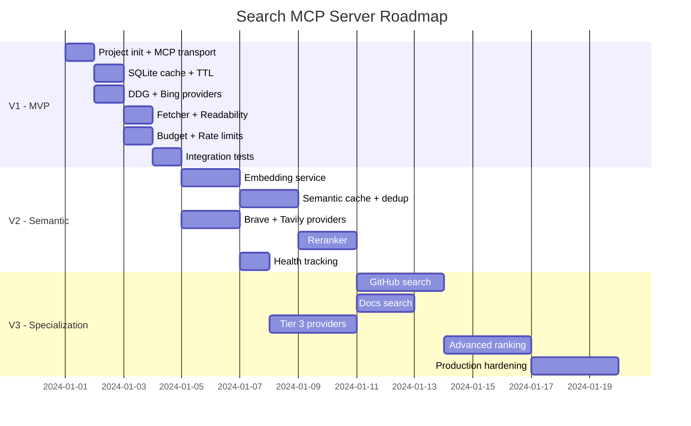

# Roadmap

## V1 — MVP (1–2 days)

Minimally working version with one provider and basic cache.

### Tasks

- [x] Project init (TypeScript, `@modelcontextprotocol/sdk`)
- [x] MCP transport (stdio, JSON-RPC)
- [x] Tool: `search` with zod validation
- [x] Tool: `status` with basic diagnostics
- [x] Query Normalizer (lowercase, trim, cache key)
- [x] SQLite cache (queries, results, pages)
- [x] TTL-based eviction
- [x] DuckDuckGo adapter (HTML scraping)
- [x] Sequential fallback (DDG → Bing)
- [x] Content Fetcher (HTTP GET → readability → markdown)
- [x] Budget Manager (search limit, fetch limit)
- [x] Rate limiting (per-provider)
- [x] Structured logging
- [x] `.env` configuration
- [x] Tests: unit for each module
- [x] Tests: integration smoke test

### V1 Result

Agent calls `search()` → first healthy provider responds → results cached → when `include_content=true` pages are fetched and cleaned.

---

## V2 — Semantic Layer + Tier 2 (3–5 days)

Semantic cache and official API providers.

### Tasks

- [x] Embedding service (multilingual-e5-small)
- [x] sqlite-vec integration
- [x] Semantic query cache (find similar, threshold 0.92)
- [x] Query deduplication (buffer last 50 queries)
- [x] Provider: Brave Search API adapter
- [x] Provider: Tavily API adapter
- [x] Reranker: semantic similarity scoring
- [x] Reranker: domain quality scoring
- [x] Reranker: freshness scoring
- [x] Reranker: position blending
- [x] Weighted final score
- [x] Intent-aware reranking weights
- [x] Deduplication by URL
- [x] Provider health tracking
- [x] Provider health recovery (5-min retry)
- [x] Extended `status()` (provider health, cache stats)
- [x] Tests: semantic cache
- [x] Tests: reranker scoring

### V2 Result

Agent gets deduplicated, ranked results. Similar queries don't waste budget. 4 providers with fallback.

---

## V3 — Specialization + Production (1–2 weeks)

Specialized search modes and production-ready hardening.

### Tasks

- [x] GitHub-specific search (GitHub API, repos/code/issues/users)
- [x] GitLab-specific search (GitLab API, projects/issues/MRs/blobs)
- [ ] Docs-specific search (prioritize readthedocs, docs.*, MDN)
- [ ] Intent routing: automatic intent detection by query
- [ ] Advanced ranking: learning-to-rank based on agent feedback
- [ ] Provider health scoring (composite: latency + error rate + quality)
- [x] Provider: Exa adapter
- [x] Provider: Firecrawl adapter
- [x] Parallel multi-provider queries
- [x] Result aggregation across multiple providers
- [x] Config-driven provider order, execution mode (parallel/sequential), pagination
- [x] Search timeout, cached TTL, max results after rerank
- [x] Browser User-Agent for fetch layer
- [ ] robots.txt respect (optional)
- [ ] Cache analytics (hit rate, popular queries)
- [x] DB migration system
- [x] Graceful shutdown (finish in-flight, close DB)
- [ ] Optional vector index (for large cached query volumes)
- [x] Comprehensive test suite
- [ ] Performance benchmarks
- [ ] Docker image
- [ ] Documentation: deployment guide
- [x] CI workflow (Node 20/22, npm ci, build, test)
- [x] GitLab tool hidden when token absent

### V3 Result

Production-ready MCP Search Server with 6 providers, GitHub/GitLab search, config-driven provider order, parallel/sequential execution, per-provider pagination limits, and full test suite.

---

## Dependencies by Phase

## Tech Stack

| Category | Technology | Version |
|----------|-----------|---------|
| Runtime | Node.js | >= 20 |
| Language | TypeScript | >= 5.3 |
| MCP SDK | `@modelcontextprotocol/sdk` | latest |
| Database | better-sqlite3 | latest |
| Vector | sqlite-vec | latest |
| Validation | zod | latest |
| HTML parsing | @mozilla/readability | latest |
| DOM | linkedom | latest |
| Markdown | turndown | latest |
| Embeddings | @xenova/transformers | latest |
| HTTP | undici (built-in fetch) | built-in |
| Config | dotenv | latest |
| Logging | pino | latest |
| Testing | vitest | latest |
